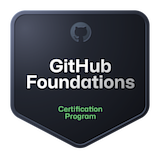

# GitHub Foundation Certification Practice Material

## What is the GitHub Foundation Certification?
The GitHub Foundation Certification is a credential that validates your understanding of foundational topics and concepts related to collaborating, contributing, and working on GitHub. This certification covers a range of skills essential for anyone looking to demonstrate their proficiency with GitHub and Git, making it an excellent addition to your resume.

## My Certificate

## Exam Guide
- [GitHub Foundation Exam Guide](./github-foundation-exam-guide.pdf)

## Common Mistakes

### ⚠ Common Mistakes Made

🔸 **Incomplete Syllabus Coverage:** Not covering the entire syllabus of the exam.

🔸 **Technical Issues:** Running the tutorial exam and finding an issue that prevented the exam from starting, wasting two days to resolve it.

🔸 **Device Compatibility:** Not ensuring the device is compatible with the exam software.

🔸 **Note-taking:** Making handwritten notes, which was time-consuming. Taking screenshots of the content might have helped complete the syllabus on time.

🔸 **Environment Check Anxiety:** Worrying too much about the environment check by the exam invigilator, which turned out to be straightforward.

🔸 **Exam Breaks:** You get three breaks during the exam. Although you can't leave your place, you can take a break.

## Online Resources
The following course by Free Code Camp provides everything needed to pass the exam:
- [Free Code Camp Course](https://youtu.be/Jdc0i7RcBv8?si=DxytRcU_DOKsvxX2)

### Microsoft Foundation Learning Path
- [Microsoft Learning Path](https://learn.microsoft.com/en-us/collections/o1njfe825p602p?wt.mc_id=studentamb_242899)

## MCQs
- [GitHub Foundation Questions and Answers](./github-foundation-exam-q&a.pdf)

---

Feel free to reach out if any guidance is needed. Good luck on your journey to becoming GitHub Certified!

